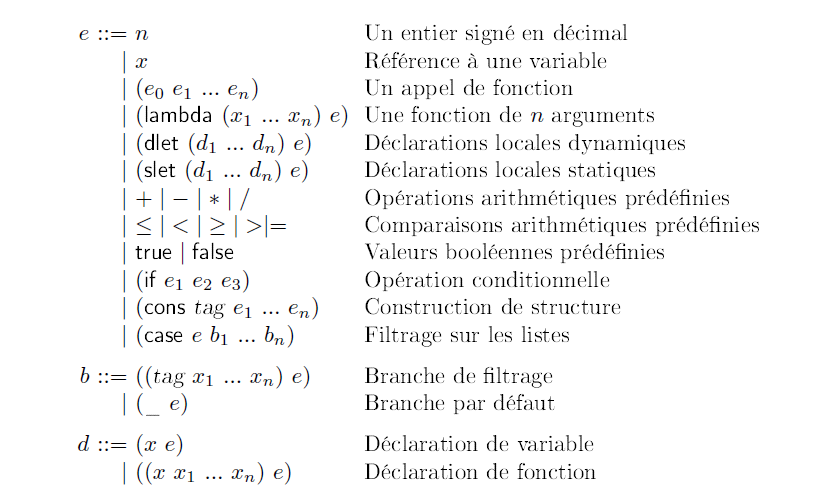

# IFT2035TP1～

## Description
#### Introduction
- This is my course project1 for [**ift2035 concepts of programming languages**](https://www.iro.umontreal.ca/~monnier/2035/) at university of montreal. 
- Task: Write in haskell a part of an interpreter for a language `slip` which is a lisp dialect. 

#### Grammer of the language slip

<!-- $$ 
\begin{align*}
    
\end{align*}
$$ -->

#### Steps for executing
1. Install [GHC](https://www.haskell.org/downloads/)
2. In terminal run `> ghci slip.hs` and you will get something like
    ```
    GHCi, version 8.10.7: https://www.haskell.org/ghc/  :? for help
    [1 of 1] Compiling Main             ( slip.hs, interpreted )
    ```
    Just ignore all the warnings.
3. Execute `run tests.slip` will print
   ```
   *Main> run "tests.slip"
   *Main>[5,[false],25,86106,2172,8,26,15,16,7,11]
   ```
   which is the result of interpreting file `tests.slip` containing several expressions in "slip". Here is an overview of  `test.slip`:
   <br>
   ```
   ;;; Yuchen Hui Yuyang Xiong. 
    (case (cons myCons 1 
                    (slet ((x 9) 
                            ((fn x y) (x (y /)))) 
                        (18 (x fn)))
                    3) 
            ((nil x1 x2 x3) 7) ((myCons x1 x2 x3) (x3 ((x2 (x1 *)) +))) (_ 0))      ; ↝ 5


    (if ((dlet (((curried- x1) (dlet ((x x1)) (lambda (y) (y (x -)))))
            (x 23))
        (43 (80 curried-))) (-19 =)) 
        (789 (29385 (2312 (lambda (x y z) (z ((y (x *)) /))))))
        (2 ((case (cons myCons) ((nil) 1999) ((myCons) 1) (_ 123124)) =)))         ; ↝ [ false ]


    (dlet ((x x1)
        ((fn y1) (dlet ((y y1)) (lambda (y) (x (y *))))))
        (dlet ((x (case (cons myCons 1 
                                    (slet ((x 9) 
                                        ((fn x y) (x (y /)))) 
                                        (18 (x fn)))
                                    3) 
                            ((nil x1 x2 x3) 7) ((myCons x1 x2 x3) (x3 ((x2 (x1 *)) +))) (_ 0))))
            (x (200 fn))))                                                          ; ↝ 25


    (case (cons myCons 789 29385 2312 1999) 
        ((myCons p q r s) (if ((dlet (((curried- x1) (dlet ((x x1)) (lambda (y) (y (x -)))))
                                    (x 23))
                                (43 (80 curried-))) (-20 =)) 
                                (p (q (r (lambda (x y z) (z ((y (x *)) /))))))
                                (2 ((case (cons myCons) ((nil) s) ((myCons) 1) (_ 123124)) =))))
        ((hisCons p q r s) (if ((dlet (((curried- x1) (dlet ((x x1)) (lambda (y) (y (x -)))))
                                    (x 12412))
                                (413 (4120 curried-))) (-19 =)) 
                                (p (q (r (lambda (x y z) (z ((y (x *)) /))))))
                                (2 ((case (cons myCons) ((nil) s) ((myCons) 1) (_ 123124)) =))))
        (_ 10000))                                                                ; ↝ 86106


    (slet ((x1 1999) 
        (x2 (dlet ((x x1)
                    ((fn y1) (dlet ((y y1)) (lambda (y) (x (y *))))))
                    (dlet ((x (case (cons myCons 1 
                                                (slet ((x 9) 
                                                        ((fn x y) (x (y /)))) 
                                                    (18 (x fn)))
                                                3)
                                    ((nil x1 x2 x3) 7) ((myCons x1 x2 x3) (x3 ((x2 (x1 *)) +))) (_ 0))))
                        (x (200 fn)))))
        (x3 (slet ((x 9) ((fn x y) (x (y /)))) (18 (x fn)))) 
        (x4 10) 
        (x5 23)) 
        (x5 (x4 (x3 ((x2 (x1 *)) +) -) /)))                                         ; ↝ 2172

    (5 (4 (3 (2 (1 (lambda (x) (lambda (x1) (lambda (x2) (lambda (x3) (lambda (x4) (x4 (x2 +)))))))))))) ; ↝ 8


    (dlet (((curried+ x1) (slet ((x 20)) (lambda (y) (y (x +))))))
                        (slet ((x 10)) (6 (5 curried+))))           ; ↝ 26


    (dlet (((curried+ x1) (slet ((x 9)) (lambda (y) (y (x +))))))
                        (dlet ((x 10)) (6 (5 curried+))))              ; ↝ 15
                        
    (dlet (((curried+ x1) (dlet ((x 9)) (lambda (y) (y (x +))))))
                        (dlet ((x 10)) (6 (5 curried+))))              ; ↝ 16

    (dlet (((curried+ x1) (slet ((x1 1)) (lambda (y) (y (x1 +))))))
                        (dlet ((x1 10)) (6 (5 curried+))))              ; ↝ 7

                        
    (dlet (((curried+ x1) (dlet ((x1 1)) (lambda (y) (y (x1 +))))))
                        (dlet ((x1 10)) (6 (5 curried+))))             ; ↝ 11

   ```
#### Last but not least
For more details about the project, you may refer to [slip.pdf](slip.pdf) (in French)

## VERSION FRANÇAISE  
VOIR SLIP.PDF POUR L'ÉNONCÉ DU TRAVAIL.

## 中文版本：

这是我在蒙特利尔大学二年级上学期上的一门课的课程设计（？）之一。具体的内容是用haskell语言完成一个叫做‘slip’的lisp方言的解释器的一部分。
作业任务的描述请见slip.pdf。

